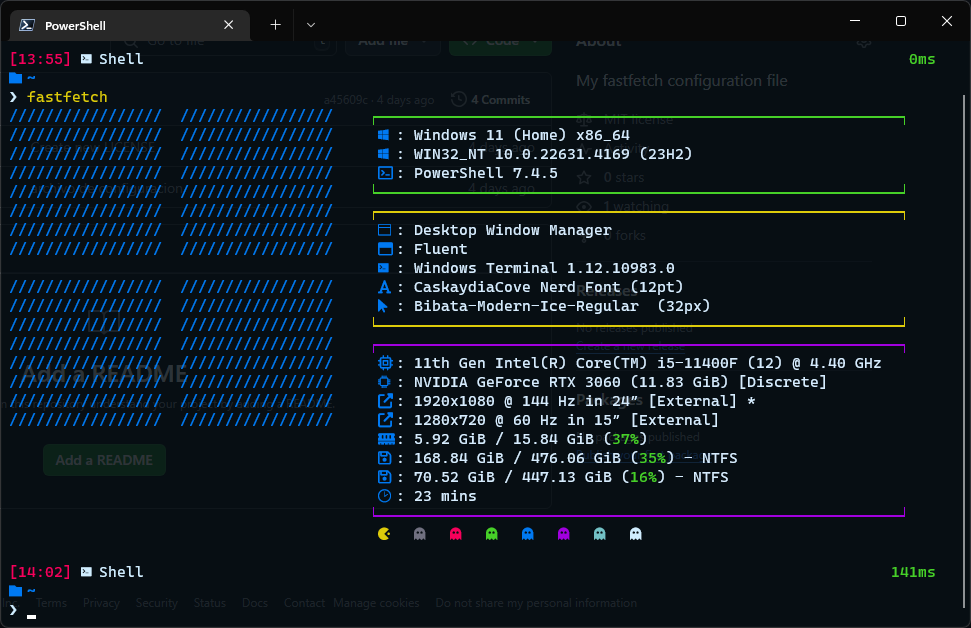
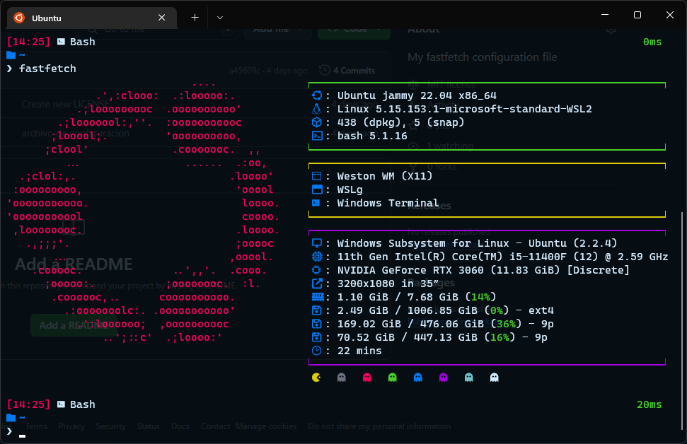

# FastFetch Configuration

My configuration file for [fastfetch](https://github.com/fastfetch-cli/fastfetch)

## Instalation

Go to directory `~/.config/fastfetch` in Linux or `c:/programdata/fastfetch` in windows and run the next command:

```bash
curl -O https://raw.githubusercontent.com/EdgarEspinozaN/fastfetch-configs/refs/heads/main/config.jsonc
```

## Preview

### Linux


### Windows



### WSL



